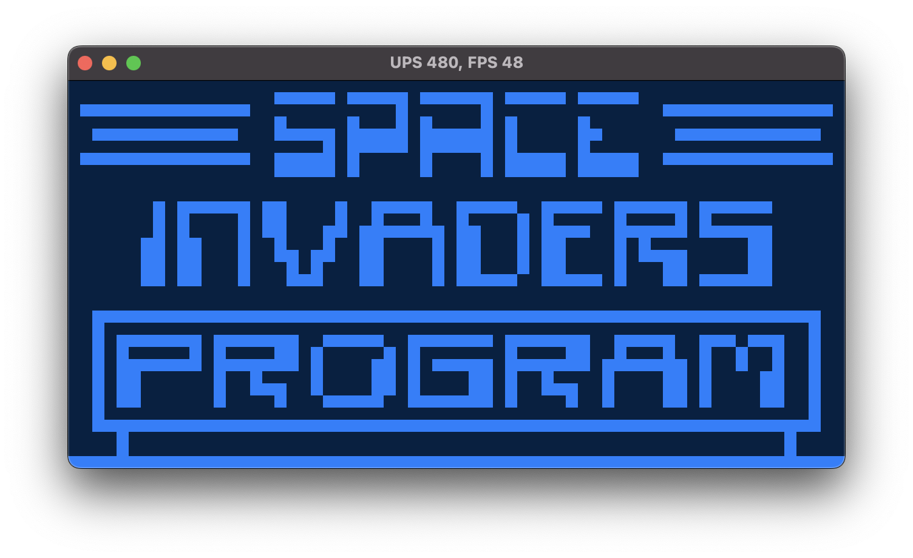

# Crust-8



This CHIP-8 emulator is a port (with improvements!)
of my Java emulator: [BeanChip](https://github.com/ChristianLowe/BeanChip)

CHIP-8 is an old bytecode specification which was used to make some simple games.
More info can be found on [Wikipedia](https://en.wikipedia.org/wiki/CHIP-8).

### Usage:
```
./crust [OPTIONS] <PATH>

ARGS:
<PATH>    Path to a file containing CHIP-8 bytecode

OPTIONS:
-h, --help       Print help information
-q, --quirks     Whether quirks mode should be active (required for some games to work)
-V, --version    Print version information
```

### Keypad Mapping:
```
   Keypad                   Keyboard
   +-+-+-+-+                +-+-+-+-+
   |1|2|3|C|                |1|2|3|4|
   +-+-+-+-+                +-+-+-+-+
   |4|5|6|D|                |Q|W|E|R|
   +-+-+-+-+       =>       +-+-+-+-+
   |7|8|9|E|                |A|S|D|F|
   +-+-+-+-+                +-+-+-+-+
   |A|0|B|F|                |Z|X|C|V|
   +-+-+-+-+                +-+-+-+-+
```

### References:
* http://www.multigesture.net/articles/how-to-write-an-emulator-chip-8-interpreter/
* http://mattmik.com/files/chip8/mastering/chip8.html
* https://github.com/mattmikolay/chip-8/wiki/CHIP%E2%80%908-Technical-Reference